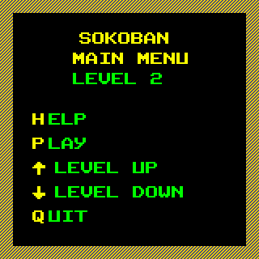
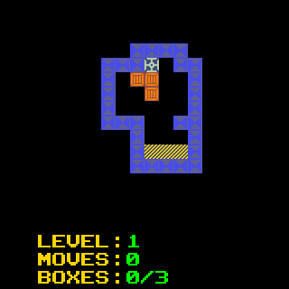
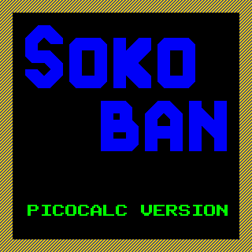
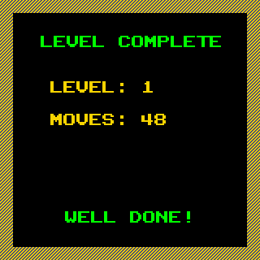
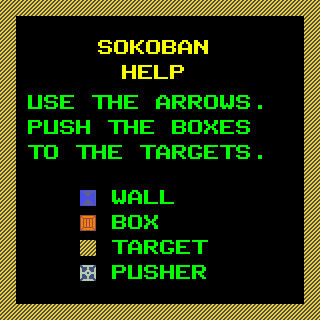

# Sokoban – PicoCalc Version (MMBasic, English)

This project is an **adaptation to the PicoCalc BASIC dialect** of the classic logic game **Sokoban**, originally created in 1981 by **Hiroyuki Imabayashi** in Japan.  
Sokoban (literally “warehouse keeper”) is considered one of the most influential puzzle games and has been ported to virtually every platform since the 1980s.

   

## Game origin
In Sokoban, the player controls a character inside a warehouse whose goal is to **push boxes onto designated target positions**.  
Although the rules are very simple —move in four directions and push (but never pull) the boxes— the difficulty increases quickly, and the levels may require highly complex strategic reasoning.  
This minimalist design made Sokoban a **classic computer puzzle game**, even used in algorithm research and computational complexity theory.

## PicoCalc adaptation
This version has been:
- **Converted to the PicoCalc MMBasic dialect**, compatible with its 40-column display.  
- **Based on [a code I wrote in 2014](https://www.hpcalc.org/prime/games/sokoban15.zip) for the HP Prime calculator**, adapted and improved for this device.  
- Includes **40 playable levels** already integrated into the program.  
- **Does not include a level editor**, but it is simple to add more levels to the script by directly modifying the data tables.  
- **Updated to 2025** by the author.  

## How to play
1. Run the program on your PicoCalc:
   ```basic
   RUN "sokoban.bas"
   ````

2. Control the character to push boxes into the designated goal positions.
3. You can only **push**, never pull a box.
4. A level is considered solved when all boxes are on the correct target spots.

## Controls

* Move in four directions using the PicoCalc arrow keys.
* Restart a level if stuck (with the `ESC` key).

## Code structure

The program is organized into:

* **Loading and presentation routine**.
* **Level management** (matrices defining each map).
* **Movement logic and collision detection**.
* **Main game loop and victory check**.
* **Help screen** (brief).

## Limitations

* No integrated graphical level editor, although it is simple to add more by editing the code definitions.

## Credits

* **Original game (1981):** Hiroyuki Imabayashi.
* **HP Prime version (2014):** Ariel Palazzesi.
* **PicoCalc version (2025):** Ariel Palazzesi.

---

Enjoy this classic Japanese puzzle on your PicoCalc, with 40 challenging levels and the possibility to easily expand the collection!
