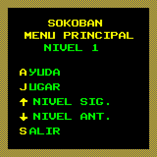
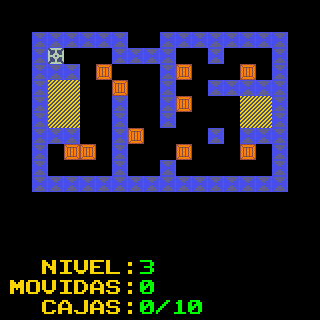
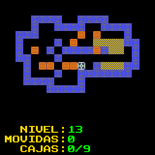
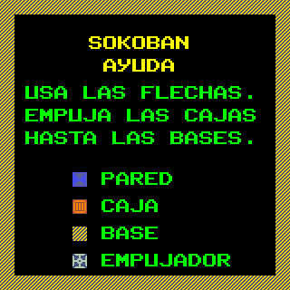

# Sokoban – Versión PicoCalc (MMBasic, Español)

Este proyecto es una **adaptación al dialecto BASIC de la PicoCalc** del clásico juego de lógica **Sokoban**, creado originalmente en 1981 por **Hiroyuki Imabayashi** en Japón.  
Sokoban (literalmente “encargado del almacén”) es considerado uno de los juegos de puzzle más influyentes, y ha sido portado a prácticamente todas las plataformas desde los años 80 hasta hoy.

   

## Origen del juego
En Sokoban el jugador controla a un personaje en un almacén, cuyo objetivo es **empujar cajas hasta colocarlas en posiciones designadas**.  
Aunque las reglas son muy simples —moverse en las cuatro direcciones y empujar (pero no tirar) las cajas—, la dificultad crece rápidamente y los niveles pueden requerir un razonamiento estratégico muy complejo.  
Este diseño minimalista convirtió a Sokoban en un **clásico de los puzzles por computadora**, utilizado incluso en investigación de algoritmos y teoría de la complejidad computacional.

## Adaptación PicoCalc
Esta versión ha sido:
- **Convertida al dialecto MMBasic de PicoCalc**, con compatibilidad para su pantalla de 40 columnas.  
- **Basada en un código [que escribí en 2014](https://www.hpcalc.org/prime/games/sokoban15.zip) para la calculadora HP Prime**, adaptado y mejorado para este dispositivo.  
- Incluye **40 niveles jugables** ya integrados en el programa.  
- **No dispone de un editor de niveles**, pero resulta sencillo agregar más niveles al script modificando directamente las tablas de datos.  
- **Actualizada al año 2025** por el autor.  

## Cómo jugar
1. Ejecutar el programa en tu PicoCalc:
   ```basic
   RUN "sokoban.bas"
   ```

2. Controla al personaje para empujar las cajas hasta las posiciones marcadas como objetivos.
3. Solo puedes **empujar**, nunca tirar de una caja.
4. Un nivel se considera resuelto cuando todas las cajas están en las posiciones correctas.

## Controles

* Movimiento en cuatro direcciones mediante las teclas de flecha de la PicoCalc.
* Reinicio de nivel en caso de quedar bloqueado (con la tecla `ESC`)

## Estructura del código

El programa está organizado en:

* **Rutina de carga y presentación**.
* **Gestión de niveles** (matrices con diseño de cada mapa).
* **Lógica de movimiento y detección de colisiones**.
* **Bucle principal de juego y comprobación de victoria**.
* **Pantalla de ayuda** (Breve)

## Limitaciones

* No incluye editor gráfico de niveles integrado, aunque es sencillo añadir más editando las definiciones en el código.

## Créditos

* **Juego original (1981):** Hiroyuki Imabayashi.
* **Versión HP Prime (2014):** Ariel Palazzesi.
* **Versión PicoCalc (2025):** Ariel Palazzesi.

---

¡Disfruta en tu PicoCalc de este clásico puzzle japonés, con 40 niveles desafiantes y la posibilidad de expandir la colección fácilmente!


