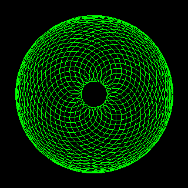
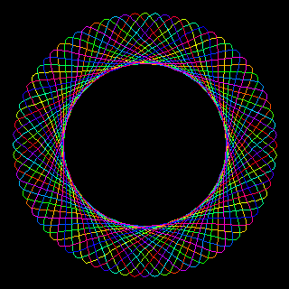
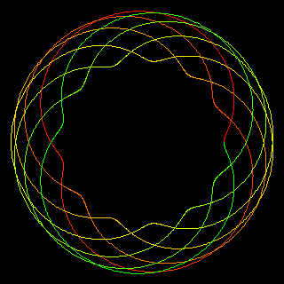
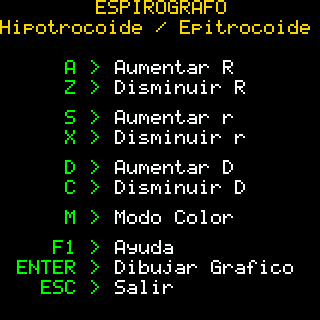

# Espirógrafo – Versión PicoCalc (MMBasic)

Este proyecto dibuja **curvas tipo espirógrafo** (hipotrocoides y epitrocoides) en la **PicoCalc** usando MMBasic. Permite ajustar los parámetros del engranaje y del orificio del lápiz, y trazar figuras con **color cíclico** (HSV>RGB) mientras se dibujan.

> En modo de uso normal: primero ves la **UI** para ajustar parámetros; al presionar **ESPACIO** se oculta la UI y se traza la curva; si presionás cualquier tecla durante el trazado, volvés a la UI para seguir iterando.

  

 

---

## Fundamento (breve)

Las figuras del espirógrafo se modelan con **trocoides**:

* **Hipotrocoide**: una rueda de radio `R2` rueda **por dentro** de un círculo fijo `R1`.
* **Epitrocoide**: la rueda rueda **por fuera** del círculo fijo.

Parámetros:

* **R1** = radio del círculo fijo (corona).
* **R2** = radio de la rueda móvil.
* **D**  = distancia del orificio del lápiz al centro de la rueda.

La curva **cierra** si `R1/R2` es racional (como engranajes con cantidades enteras de "dientes").

---

## Adaptación PicoCalc

* Escrito en **MMBasic** para PicoCalc, con compatibilidad para su resolución y teclado.
* **UI interactiva** para ajustar parámetros y elegir modo (Hypo/Epi).
* **Trazado progresivo** con control de interrupción.
* **Color cíclico** durante el dibujo (conversión HSV > RGB).
* Probado con **ángulos en radianes**.


---

## Cómo ejecutar

```basic
RUN "spiro1.bas"
```

En la UI ajustás parámetros; presioná **ESPACIO** para trazar. Cualquier tecla durante el trazado te devuelve a la UI.

---

## Controles (en la UI)

* **H / E**: Modo **H**ipotrocoide / **E**pitrocoide.
* **A / Z**: `R1` aumenta / disminuye.
* **S / X**: `R2` aumenta / disminuye.
* **D / C**: `D` aumenta / disminuye.
* **ESPACIO**: **trazar** la curva (la UI se oculta).
* **Cualquier tecla** durante el trazado: **interrumpe** y vuelve a la UI.
* **B**: limpiar pantalla y volver a mostrar la ayuda/UI.
* **ESC**: salir.

> Tip: elegí `R1` y `R2` con una razón simple (por ejemplo, 80/20) para obtener cierres limpios y figuras "de libro".

---

## Parámetros

* **R1** (radio fijo): define el “tamaño base” de la figura.
* **R2** (radio móvil): incide en la cantidad de lóbulos/puntas (según `R1/R2`).
* **D** (orificio del lápiz):

  * `D = 0` > círculo;
  * `0 < D < R2` > trocoide “suave”;
  * `D = R2` > cicloide (con cúspides nítidas);
  * `D > R2` > bucles.
* **Hypo/Epi**: rueda por **dentro** (Hypo) o por **fuera** (Epi) del círculo fijo.

---

## Color del trazado

El dibujo recorre el **matiz (Hue)** de 0 a 1 a lo largo del trazado, manteniendo `S=1` y `V=1`.
La función `HSVaRGB(h!, s!, v!, r%, g%, b%)` convierte a RGB (0–255). Podés acelerar o suavizar el cambio ajustando el paso `h_inc!` (por ejemplo, una vuelta completa de color por figura, o dos).

---

## Estructura del código

* **UI / Ayuda**: dibuja la barra superior con el modo y los valores actuales (`R1`, `R2`, `D`).
* **Bucle principal**: lee teclado; modifica parámetros y **solo traza al presionar ESPACIO**.
* **DibujarCurva**:

  * Oculta la UI (limpia), calcula el **período de cierre** con `MCD(R1, R2)`, define un número de segmentos (`seg`) y `dt = theta_max/seg`.
  * Traza por segmentos (`LINE`) y actualiza color HSV por paso.
  * Chequea `INKEY$` para **interrumpir** y volver a la UI.
* **Conversión HSV→RGB**: subrutina independiente, sin dependencias externas.
* **Utilitarios**: `MCD` (Euclides), helpers varios.


---

## Créditos

* Inspirado en el clásico **Espirógrafo** (Kenner/Hasbro) y la literatura de **trocoides**.
* **Versión PicoCalc (2025):** Ariel Palazzesi.
* Conversión HSV a RGB basada en la formulación estándar por sectores (`i% MOD 6`).


