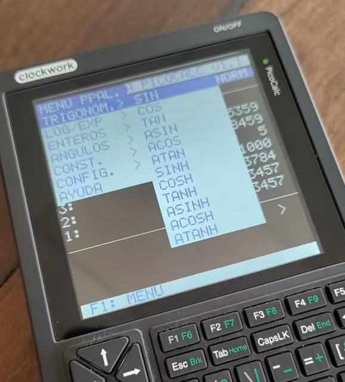

# Calculadora RPN para PicoCalc

Este proyecto implementa una **calculadora RPN (Notación Polaca Inversa)** para la PicoCalc, inspirada en la serie HP48 y programada en MMBasic.
La calculadora aprovecha la pantalla gráfica de la PicoCalc para mostrar la pila y menús jerárquicos, ofreciendo una experiencia similar a las calculadoras científicas clásicas.

## Características principales

* Interfaz con pila de hasta 8 niveles.
* Entrada de datos con edición básica (backspace, borrado).
* **Modos angulares:** DEG, RAD, GRA.
* **Modos de formato numérico:** NORM, FIX (3/6/9 decimales), SCI (3/6/9 decimales), ENG.
* Sistema de **menús jerárquicos** para acceder a funciones avanzadas.
* Pantalla de **ayuda integrada**.

##  Funciones implementadas

### Operaciones básicas

* Suma (+)
* Resta (-)
* Multiplicación (*)
* División (/)
* Potencia (^)
* Raíz cuadrada (`R`)
* Inversa (`I`)
* Factorial (`!`)

### Gestión de la pila

* `D` → DROP (elimina el tope)
* `U` → DUP (duplica el tope)
* `S` → SWAP (intercambia los dos primeros)
* `X` → CLX (limpia la pila)
* ENTER → apila valor actual o duplica tope

### Constantes

* `P` → π
* `E` → e
* `PHI` → número áureo
* `C` → velocidad de la luz
* `G` → constante gravitacional
* `H` → constante de Planck
* `QE` → carga del electrón

### Funciones trigonométricas

* SIN, COS, TAN
* ASIN, ACOS, ATAN
* SINH, COSH, TANH
* ASINH, ACOSH, ATANH

### Logaritmos y exponenciales

* LN (logaritmo natural)
* LOG (logaritmo base 10)
* EXP (exponencial)
* 10^X

### Enteros y otros

* ABS (valor absoluto)
* INT (parte entera)
* FRAC (parte fraccionaria)
* SGN (signo)
* FACT (factorial)
* PRIMO (test de primalidad, devuelve 1/0)
* MCD (máximo común divisor)
* MCM (mínimo común múltiplo)

### Conversiones de ángulos

* DEG > RAD, RAD > DEG
* DEG > GRA, GRA > DEG
* DEG > DMS, DMS > DEG

### Otras opciones

* Tecla `M` → rota entre DEG, RAD, GRA.
* Menú de configuración para cambiar entre NORM/FIX/SCI/ENG.
* Tecla F1 → abre menús de funciones.
* `Q` → salir del programa.

## Atajos útiles

* `_` → ingresar números negativos (ej: `_123` → -123).
* Backspace (BS/DEL) → borrar el último carácter de la entrada.
* Los atajos rápidos (`r`, `p`, `e`, etc.) permiten ejecutar funciones y constantes sin pasar por los menús.

